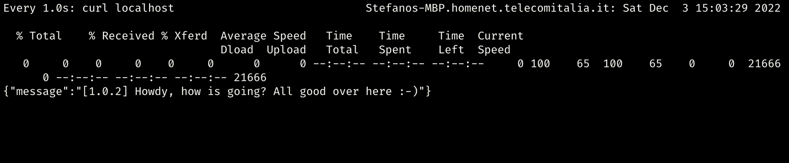
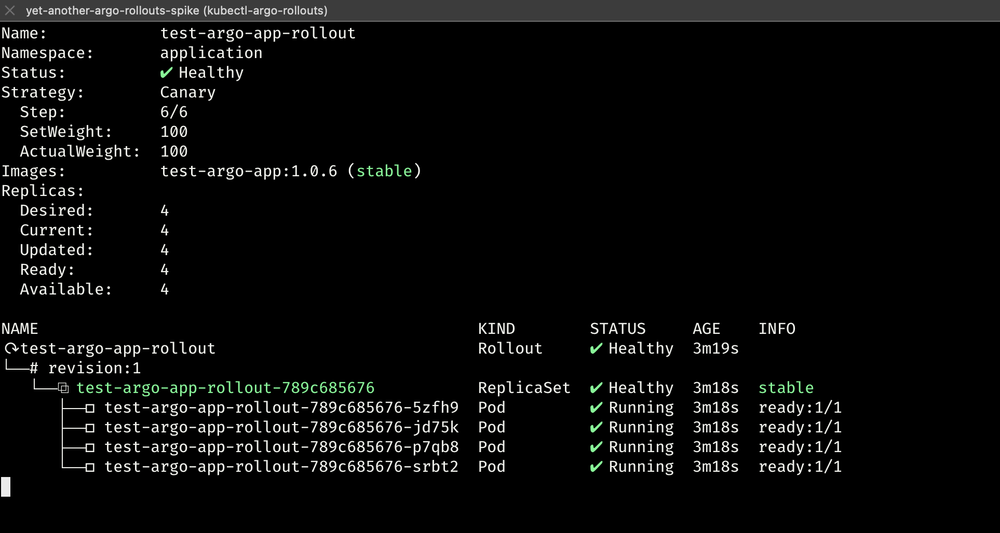

# Yet another argo rollouts spike

---
***Prerequisites:***
1. [`docker`](https://www.docker.com/)
2. [`kubectl`](https://kubernetes.io/docs/tasks/tools/)
3. [`argo-rollouts cli`](https://argoproj.github.io/argo-rollouts/features/kubectl-plugin/)
4. [`helm`](https://helm.sh/)
5. [`minikube`](https://minikube.sigs.k8s.io/docs/) or [`kind`](https://kind.sigs.k8s.io/)
6. [`yq`](https://github.com/mikefarah/yq)
7. [`jq`](https://stedolan.github.io/jq/download/)

---

This is meant to have a close look at the scenario where we have to migrate towards [`Argo Rollouts`](https://argoproj.github.io/argo-rollouts/) but instead of converting a `Deployment` to a `Rollout`, we just reference the `Deployment` within the `Rollout`.

In this repository is it possible to use different k8s such as [`minikube`](https://minikube.sigs.k8s.io/docs/), [`kind`](https://kind.sigs.k8s.io/), etc even though at the moment I tested properly only the `kind` one.

### Repository structure

```text
├── Makefile
├── README.md
├── deploy-charts
│   ├── Chart.yaml
│   ├── charts
│   │   ├── deployment
│   │   │   ├── Chart.yaml
│   │   │   ├── templates
│   │   │   │   ├── _helpers.tpl
│   │   │   │   ├── deployment.yaml
│   │   │   │   ├── ingress.yaml
│   │   │   │   └── service.yaml
│   │   │   └── values.yaml
│   │   └── strategy
│   │       ├── Chart.yaml
│   │       ├── templates
│   │       │   ├── _helpers.tpl
│   │       │   ├── rollout.yaml
│   │       │   └── service.yaml
│   │       └── values.yaml
│   ├── templates
│   │   └── _helpers.tpl
│   └── values.yaml
├── infra
│   ├── cluster.yaml
│   └── ingress_controller.yaml
└── src
    ├── Dockerfile
    ├── index.js
    └── package.json
```

* `deploy-charts/charts/deployment`: helm subchart to publish the nodejs app comprehensive of ingress
* `deploy-charts/charts/strategy`: subchart in order to install the Rollout via which we will manage the deployment in terms of strategy deployment
* `infra/cluster.yaml`: cluster to be created
* `infra/ingress_controller.yaml`: ingress controller manifest to be installed
* `src`: nodejs application comprehensive of Dockerfile for containerization
* `Makefile`: make file to automatize as much as possible what we do in this lab


### Spinning up the environnement
Let's use this mk target which will perfom the following task:
1. spin up the cluster
2. create an additional cluster
3. bind context to the last cluster created	
4. install nginx ingress controller	
5. install argo-rollouts	controller
6. build and install the app against the cluster	
	
```bash
make all
```

***output:***
```bash
/Library/Developer/CommandLineTools/usr/bin/make cluster_start \
	create_cluster \
	set_context_cluster \
	cluster_info \
	ingress_controller_install \
	wait_for_ingress_controller \
	create_argo_rollouts_namespace \
	argo_rollouts_controller_install \
	build_tag_push_image \
	create_deploy_namespace \
	deployment_install
/usr/local/bin/kind create cluster
Creating cluster "kind" ...
 ✓ Ensuring node image (kindest/node:v1.25.3) 🖼
 ✓ Preparing nodes 📦
 ✓ Writing configuration 📜
 ✓ Starting control-plane 🕹️
 ✓ Installing CNI 🔌
 ✓ Installing StorageClass 💾
Set kubectl context to "kind-kind"
You can now use your cluster with:

kubectl cluster-info --context kind-kind

Have a question, bug, or feature request? Let us know! https://kind.sigs.k8s.io/#community 🙂
/usr/local/bin/kind create \
	cluster --config=infra/cluster.yaml \
	--name test-cluster
Creating cluster "test-cluster" ...
 ✓ Ensuring node image (kindest/node:v1.25.3) 🖼
 ✓ Preparing nodes 📦
 ✓ Writing configuration 📜
 ✓ Starting control-plane 🕹️
 ✓ Installing CNI 🔌
 ✓ Installing StorageClass 💾
Set kubectl context to "kind-test-cluster"
You can now use your cluster with:

kubectl cluster-info --context kind-test-cluster

Have a nice day! 👋
/usr/local/bin/kubectl config set-context test-cluster
Context "test-cluster" modified.
/usr/local/bin/kubectl cluster-info --context kind-test-cluster
Kubernetes control plane is running at https://127.0.0.1:50442
CoreDNS is running at https://127.0.0.1:50442/api/v1/namespaces/kube-system/services/kube-dns:dns/proxy

To further debug and diagnose cluster problems, use 'kubectl cluster-info dump'.
/usr/local/bin/kubectl apply -f infra/ingress_controller.yaml
namespace/ingress-nginx created
serviceaccount/ingress-nginx created
serviceaccount/ingress-nginx-admission created
role.rbac.authorization.k8s.io/ingress-nginx created
role.rbac.authorization.k8s.io/ingress-nginx-admission created
clusterrole.rbac.authorization.k8s.io/ingress-nginx created
clusterrole.rbac.authorization.k8s.io/ingress-nginx-admission created
rolebinding.rbac.authorization.k8s.io/ingress-nginx created
rolebinding.rbac.authorization.k8s.io/ingress-nginx-admission created
clusterrolebinding.rbac.authorization.k8s.io/ingress-nginx created
clusterrolebinding.rbac.authorization.k8s.io/ingress-nginx-admission created
configmap/ingress-nginx-controller created
service/ingress-nginx-controller created
service/ingress-nginx-controller-admission created
deployment.apps/ingress-nginx-controller created
job.batch/ingress-nginx-admission-create created
job.batch/ingress-nginx-admission-patch created
ingressclass.networking.k8s.io/nginx created
validatingwebhookconfiguration.admissionregistration.k8s.io/ingress-nginx-admission created
/Library/Developer/CommandLineTools/usr/bin/make wait_for_ingress_controller
/usr/local/bin/kubectl wait --namespace ingress-nginx \
  --for=condition=ready pod \
  --selector=app.kubernetes.io/component=controller \
  --timeout=90s
pod/ingress-nginx-controller-5b9f994b4c-xb2qm condition met
/usr/local/bin/kubectl wait --namespace ingress-nginx \
  --for=condition=ready pod \
  --selector=app.kubernetes.io/component=controller \
  --timeout=90s
pod/ingress-nginx-controller-5b9f994b4c-xb2qm condition met
/usr/local/bin/kubectl create namespace argo-rollouts
namespace/argo-rollouts created
/usr/local/bin/kubectl apply \
	-n argo-rollouts \
	-f https://github.com/argoproj/argo-rollouts/releases/latest/download/install.yaml
customresourcedefinition.apiextensions.k8s.io/analysisruns.argoproj.io created
customresourcedefinition.apiextensions.k8s.io/analysistemplates.argoproj.io created
customresourcedefinition.apiextensions.k8s.io/clusteranalysistemplates.argoproj.io created
customresourcedefinition.apiextensions.k8s.io/experiments.argoproj.io created
customresourcedefinition.apiextensions.k8s.io/rollouts.argoproj.io created
serviceaccount/argo-rollouts created
clusterrole.rbac.authorization.k8s.io/argo-rollouts created
clusterrole.rbac.authorization.k8s.io/argo-rollouts-aggregate-to-admin created
clusterrole.rbac.authorization.k8s.io/argo-rollouts-aggregate-to-edit created
clusterrole.rbac.authorization.k8s.io/argo-rollouts-aggregate-to-view created
clusterrolebinding.rbac.authorization.k8s.io/argo-rollouts created
secret/argo-rollouts-notification-secret created
service/argo-rollouts-metrics created
deployment.apps/argo-rollouts created
/Library/Developer/CommandLineTools/usr/bin/make build tag load_image
/usr/local/bin/docker build \
	-t test-argo-app:1.0.6 \
	--pull \
	--no-cache \
	-f ./src/Dockerfile \
	./src
[+] Building 6.5s (9/9) FINISHED
 => [internal] load build definition from Dockerfile                                                             0.0s
 => => transferring dockerfile: 36B                                                                              0.0s
 => [internal] load .dockerignore                                                                                0.0s
 => => transferring context: 2B                                                                                  0.0s
 => [internal] load metadata for docker.io/library/node:16                                                       1.5s
 => [internal] load build context                                                                                0.0s
 => => transferring context: 62B                                                                                 0.0s
 => [1/4] FROM docker.io/library/node:16@sha256:68fc9f749931453d5c8545521b021dd97267e0692471ce15bdec0814ed1f8fc  0.0s
 => CACHED [2/4] WORKDIR /home/app                                                                               0.0s
 => [3/4] COPY index.js package.json ./                                                                          0.1s
 => [4/4] RUN npm install                                                                                        4.6s
 => exporting to image                                                                                           0.2s
 => => exporting layers                                                                                          0.2s
 => => writing image sha256:0d64baaa5c779adbb822a7f21352940b7ffd9446fb14b348216c1b91e79176de                     0.0s
 => => naming to docker.io/library/test-argo-app:1.0.6                                                           0.0s

Use 'docker scan' to run Snyk tests against images to find vulnerabilities and learn how to fix them
/usr/local/bin/docker tag \
	test-argo-app:1.0.6 \
	test-argo-app:1.0.6
/usr/local/bin/kind load docker-image test-argo-app:1.0.6 --name test-cluster
Image: "" with ID "sha256:0d64baaa5c779adbb822a7f21352940b7ffd9446fb14b348216c1b91e79176de" not yet present on node "test-cluster-control-plane", loading...
/usr/local/bin/kubectl create namespace application
namespace/application created
/usr/local/bin/helm upgrade --install \
	--debug \
	-n application \
	-f deploy-charts/values.yaml \
	--set 'deployment.enabled=true' \
	--set 'strategy.enabled=false' \
	test-argo-app-release ./deploy-charts
history.go:56: [debug] getting history for release test-argo-app-release
Release "test-argo-app-release" does not exist. Installing it now.
install.go:178: [debug] Original chart version: ""
install.go:195: [debug] CHART PATH: /Users/stefanoabalsamo/MyProjects/yet-another-argo-rollouts-spike/deploy-charts

client.go:128: [debug] creating 3 resource(s)
NAME: test-argo-app-release
LAST DEPLOYED: Sat Dec  3 15:00:05 2022
NAMESPACE: application
STATUS: deployed
REVISION: 1
TEST SUITE: None
USER-SUPPLIED VALUES:
argoRolloutsNamespace: argo-rollouts
argoRolloutsReleaseName: test-argo-rollouts-release
clusterName: test-cluster
deployemntReleaseName: test-argo-app-release
deployment:
  app:
    name: test-argo-app
    tag: 1.0.6
  enabled: true
k8s:
  engine: kind
strategy:
  enabled: false

COMPUTED VALUES:
argoRolloutsNamespace: argo-rollouts
argoRolloutsReleaseName: test-argo-rollouts-release
clusterName: test-cluster
deployemntReleaseName: test-argo-app-release
deployment:
  app:
    name: test-argo-app
    tag: 1.0.6
  deployment:
    namespace: application
    replicas: 4
  enabled: true
  global: {}
k8s:
  engine: kind
strategy:
  enabled: false

HOOKS:
MANIFEST:
---
# Source: deploy-charts/charts/deployment/templates/service.yaml
apiVersion: v1
kind: Service
metadata:
  name: test-argo-app-service
spec:
  type: ClusterIP
  selector:
    app: test-argo-app
  ports:
  - port: 3000
    protocol: TCP
    targetPort: 3000
    name: http
  sessionAffinity: None
---
# Source: deploy-charts/charts/deployment/templates/deployment.yaml
apiVersion: apps/v1
kind: Deployment
metadata:
  name: test-argo-app-deployment
  annotations:
    version: 1.0.0
spec:
  progressDeadlineSeconds: 600
  revisionHistoryLimit: 10
  selector:
    matchLabels:
      app: test-argo-app
  replicas: 4
  strategy:
    rollingUpdate:
      maxSurge: 25%
      maxUnavailable: 25%
    type: RollingUpdate
  template:
    metadata:
      labels:
        app: test-argo-app
    spec:
      securityContext: {}
      terminationGracePeriodSeconds: 30
      containers:
        - name: test-argo-app
          image: test-argo-app:1.0.6
          imagePullPolicy: IfNotPresent
          env:
          - name: TEST_VAR
            value: 1.0.2
          ports:
          - containerPort: 3000
            protocol: TCP
          resources:
            limits:
              cpu: 300m
              memory: 1G
            requests:
              cpu: 200m
              memory: 500M
---
# Source: deploy-charts/charts/deployment/templates/ingress.yaml
apiVersion: networking.k8s.io/v1
kind: Ingress
metadata:
  name: test-argo-app-ingress
spec:
  rules:
  - http:
      paths:
      - pathType: Prefix
        path: "/"
        backend:
          service:
            name: test-argo-app-service
            port:
              number: 3000
```


### Let's check if the application just deployed is up
```bash
watch -n 1 curl localhost
```


### Now let's migrate our `Deployment` to a `Rollout` and check it out afterwards
```bash
make rollout_install
```
```bash
kubectl argo rollouts \
get rollout test-argo-app-rollout \
--watch -n application
```



### After that let's modify our deployment in order to trigger a new revision
 [`deploy-charts/charts/deployment/templates/deployment.yaml`](deploy-charts/charts/deployment/templates/deployment.yaml) 
```yaml
...
  template:
    metadata:
      labels:
        app: {{ .Values.app.name }}
    spec:
      securityContext: {}
      terminationGracePeriodSeconds: 30
      containers:
        - name: {{ .Values.app.name }}
          image: {{ include "imageName" (dict "values" .Values) }} 
          imagePullPolicy: IfNotPresent
          env:
          - name: TEST_VAR
            value: 1.0.3 # change this value to trigger a new revision
...
```

### Before applying let's modify [`deploy-charts/charts/deployment/values.yaml`](deploy-charts/charts/deployment/values.yaml) and in particular the number of replica in order to prevent from reinstating the original deployment's pods which would be incorrect in essence [keep reading :-)]
```yaml
deployment:
  replicas: 0
  namespace: application
```

```bash
make deployment_install
```
### or better yet I created a specific `make` target which will perform helm install but passing the replicas param in order to keep deployment's pods to zero (i.e.`--set 'deployment.deployment.replicas=0'`)

```bash
make deployment_update
```

```makefile
deployment_install:
	$(HELM) upgrade --install \
	--debug \
	-n $(DEPLOY_NAMESPACE) \
	-f deploy-charts/values.yaml \
	--set 'deployment.enabled=true' \
	--set 'strategy.enabled=false' \
	$(DEPLOYMENT_RELEASE_NAME) ./deploy-charts

deployment_update:
	$(HELM) upgrade --install \
	--debug \
	-n $(DEPLOY_NAMESPACE) \
	-f deploy-charts/values.yaml \
	--set 'deployment.enabled=true' \
	--set 'deployment.deployment.replicas=0' \
	--set 'strategy.enabled=false' \
	$(DEPLOYMENT_RELEASE_NAME) ./deploy-charts
```


### Some commands might be handy for the lab
```bash
kubectl argo rollouts \
get rollout test-argo-app-rollout \
--watch -n application
```
```bash
kubectl argo rollouts \
promote test-argo-app-rollout \
-n application
```
```bash
kubectl argo rollouts \
undo test-argo-app-rollout \
-n application
```
```bash
kind get clusters
```
```bash
kubectl config set-context test-cluster
```
